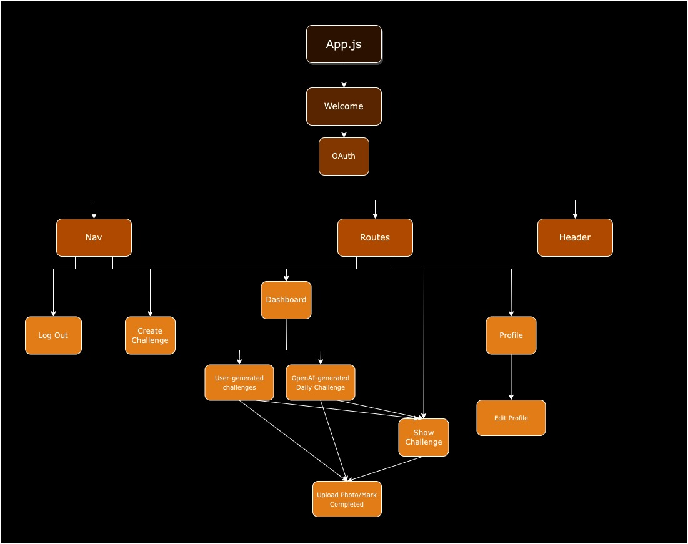
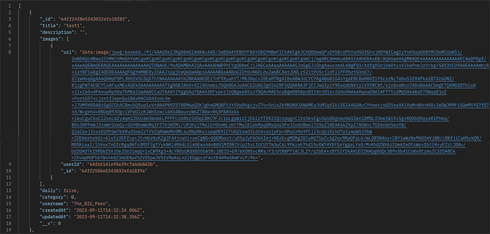

# Kindr
☁️☀️☁️☀️☁️☀️☁️
### Kindr is an app. It is very good. VERY good.
Kindr is a heartwarming mobile app designed to inspire and spread kindness in your community and beyond. With Kindr, you can create and share meaningful good deeds for others to undertake, fostering a culture of compassion and positivity. Users can participate by completing deeds posted by fellow members or by taking on the daily challenge, making each day an opportunity to make the world a better place, one act of kindness at a time.

☁️☀️☁️☀️☁️☀️☁️
## Links
[Planning Doc](https://docs.google.com/spreadsheets/d/1kXggdpVkpJB4srXLQ7oCzz-bO5aigSFOcm3LXgskZB4/edit?usp=sharing)
## Wireframes
[Desktop Homepage](wireframes/desktop-welcomepage.jpg)

[Navbar Open](wireframes/mobile-sidebar-open.jpg)

[Navbar Closed](wireframes/userpage.jpg)

## Component Tree

## JSON Sample

View Challenge

## User Model
| Property      | DataType |
| ----------- | ----------- |
| _id                   | ObjectId       |
| username              | String         |
| email                 | String         |
| user_id               | String         |
| name                  | String         |
| picture               | String         |
| completedChallenges   | {type: [Schema.Types.ObjectId], ref: "Challenge"} |
| score                 | Number         |
| timestamps            | true           |

## Challenge Model
| Property      | DataType       |
| -----------   | -----------    |
| _id           | ObjectId       |
| title         | String         |
| description   | String         |
| images        | [imagesSchema] |
| daily         | Boolean        |
| category      | Number         |
| username      | String         |
| timestamps    | true           |

## Images Model
| Property    | DataType    |
| ----------- | ----------- |
| _id         | ObjectId    |
| url         | String      |
| userId      | String      |

## User Stories
### MVP
**As a user, I want to:**
- create an account so I can create, view, and complete deeds
- see a new daily challenge every day so there is always something new to engage with
- post documentation proving I did the deed
- have a score that keeps track of how many good deeds I've performed
- have the ability to edit my profile image and username
- have the ability to view the details of a deed:
    - who has completed it
    - what image they uploaded when they completed it
- log in/out
### Icebox
**As a user, I want to:**
- be able to use the website on mobile
- add other users as friends
- upload my own deeds for friends to complete
- have a deed streak when I complete challenges every day
- be able to view deeds by category
- share my completed deeds to social media
- take part in group deed events