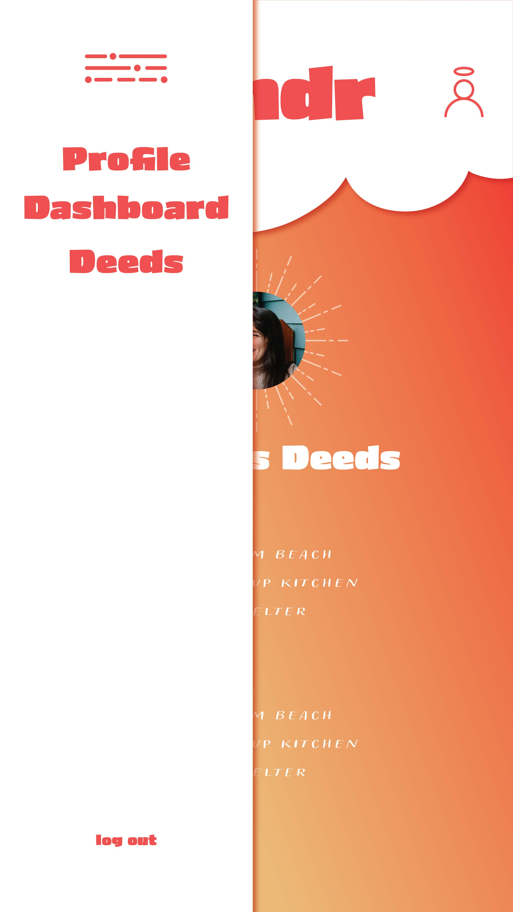
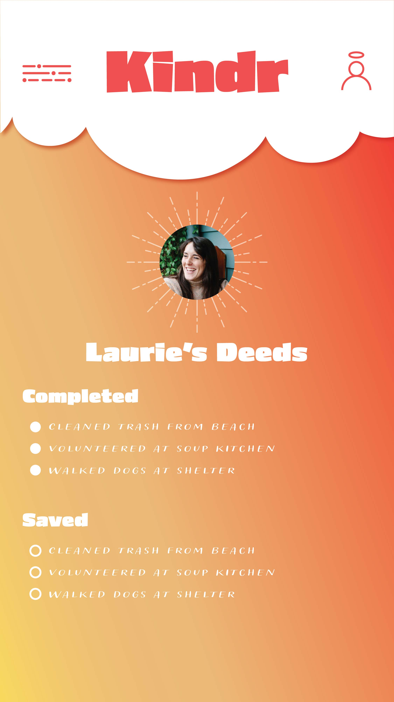

# Kindr
☁️☀️☁️☀️☁️☀️☁️
### Kindr is an app. It is very good. VERY good.
Kindr is a heartwarming mobile app designed to inspire and spread kindness in your community and beyond. With Kindr, you can create and share meaningful good deeds for others to undertake, fostering a culture of compassion and positivity. Users can participate by completing deeds posted by fellow members or by taking on the daily challenge, making each day an opportunity to make the world a better place, one act of kindness at a time.

☁️☀️☁️☀️☁️☀️☁️

## Select Wireframes

## Technologies Used
- React
- JS
- HTML
- CSS
- OpenAI
- Express
- Node
- MongoDB
- Mongoose
- Heroku
- Netlify

## Getting Started
### Deployed App
### [Project Planning](https://docs.google.com/spreadsheets/d/1kXggdpVkpJB4srXLQ7oCzz-bO5aigSFOcm3LXgskZB4/edit?usp=sharing)
## Planned Future Enhancements
- Design a "Deed Streak" feature when users complete deeds every day
- *View Deeds by Category* option
- *Share to social media* cards
- Signups for group events
- Integrate cloudinary for image uploads to save space in database
- Add other users as friends
- Make fully mobile-friendly