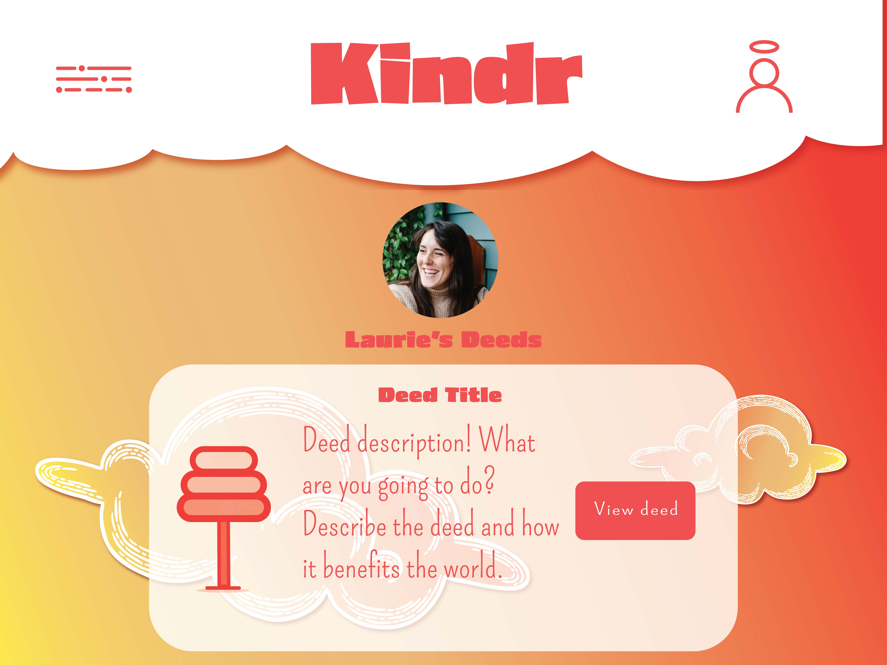

# Kindr
☁️☀️☁️☀️☁️☀️☁️
### Kindr is an app. It is very good. VERY good.
Kindr is a heartwarming mobile app designed to inspire and spread kindness in your community and beyond. With Kindr, you can create and share meaningful good deeds for others to undertake, fostering a culture of compassion and positivity. Users can participate by completing deeds posted by fellow members or by taking on the daily challenge, making each day an opportunity to make the world a better place, one act of kindness at a time.

☁️☀️☁️☀️☁️☀️☁️

## Select Wireframes

Welcome Page

Profile Page

Profile Page with Sidebar Navigation expanded

Challenge Detail page

## Technologies Used
- React
- JS
- HTML
- CSS
- OpenAI
- Express
- Node
- MongoDB
- Mongoose
- Heroku
- Netlify

## Getting Started
### [Deployed App](https://graceful-pixie-5234dd.netlify.app)
When you first visit Kindr, you'll be directed to the **Welcome Page**
- Click the **Log In** button  
- As it is your first time visiting the site, you will need to **Sign Up** and create a username and password.

  
Once logged in, you'll be directed to the **Deed Dashboard** 
- This showcases all Deeds: user-generated deeds and Daily Deeds generated via OpenAI.   
To view the details of a deed (who has completed it), click **View Deed**  
- If you have completed a deed, you will need to upload photo proof in order to mark it complete. 
Once you have uploaded your photo and marked it complete, it will appear in the list of **Completed Deeds** in your profile.   
To **view your profile**, you can either click the user icon in the header, or click "Profile" in the sidebar navigation.  
- If you would like to change your profile picture or username, you can click the "edit profile" button on the user page.   
To **add a deed**, select "add a deed" in the sidebar nav.  
- Give your deed a title and description, and select the applicable category from the dropdown menu. Once you add your deed, you will automatically be redirected to your dashboard, where you will see your new deed!   
### [Project Planning](https://docs.google.com/spreadsheets/d/1kXggdpVkpJB4srXLQ7oCzz-bO5aigSFOcm3LXgskZB4/edit?usp=sharing)
## Planned Future Enhancements
- Design a "Deed Streak" feature when users complete deeds every day
- *View Deeds by Category* option
- *Share to social media* cards
- Signups for group events
- Integrate cloudinary for image uploads to save space in database
- Add other users as friends
- Make fully mobile-friendly

## Resources
- Cloud assets adapted from [freepik](https://www.freepik.com/free-vector/hand-drawn-style-cloud-collection_16135259.htm)
- Icon assets adapted from SVG Repo ([sparkles](https://www.svgrepo.com/svg/400756/sparkles), [pig](https://www.svgrepo.com/svg/481669/pig-illustration), [books](https://www.svgrepo.com/svg/383225/education-books-apple), [tree](https://www.svgrepo.com/svg/427554/nature-plant-tree))
- [Starburst assets](https://www.freepik.com/free-vector/linear-flat-sunburst-collection_15694439.htm) were adapted to create other website assets
